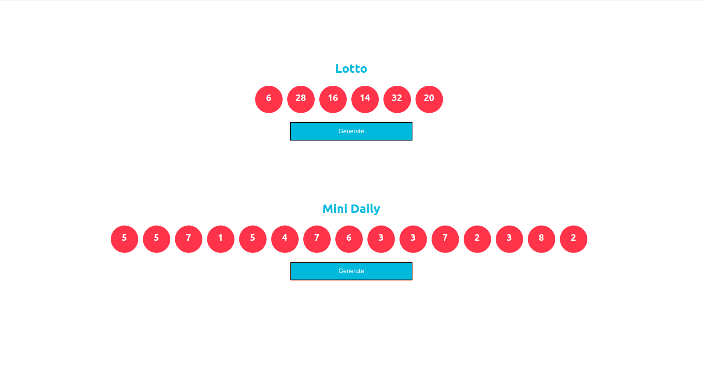

## Lottery App

 - Displaying random number of balls
 - Having multiple category
 - Rendering balls are depend on num of balls are sending as a prop
 - ```Genterating button``` is is displaying random numbers on the balls

### Output of the App
 

### How to run this app ?
- Clone this repo
- Install all packages ```npm i```
- Run the start script ```npm start```

#### Note
It supports node v10