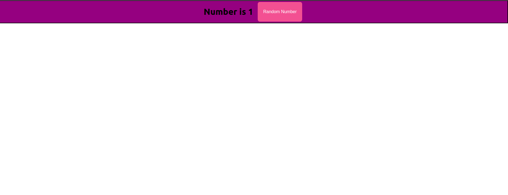

### State clicker app
- This app is showing the use of ```react state```
- It's showing random numbers.
- Limit is giving in the props to show numbers.
- if random click is 7 user is won.

# Output of the App



# App Video

